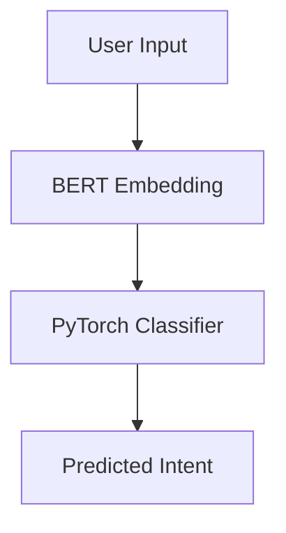

# Business Intent Classifier (BERT + PyTorch)

This is a real-time message classifier that uses BERT embeddings and PyTorch to categorize business messages into:

- Complaint  
- Order Update  
- Meeting Request  
- General Feedback  

## How It Works



## File Structure

```text
email-intent-pytorch/
├── app_bert.py
├── train_model_bert.py
├── model_bert.pth
├── encoder.pkl
├── intents_expanded.csv
├── requirements.txt
└── README.md
```

## Run Locally

1. Install dependencies

    ```bash
    pip install -r requirements.txt
    ```

1. Train the model

    ```bash
    python train_model_bert.py
    ```

1. Launch the app

    ```bash
    python app_bert.py
    ```

Go to [http://localhost:7860](http://localhost:7860) in your browser.

## Tech Stack

- sentence-transformers  
- PyTorch  
- scikit-learn  
- Gradio

## Author

Made by Farrukh.
